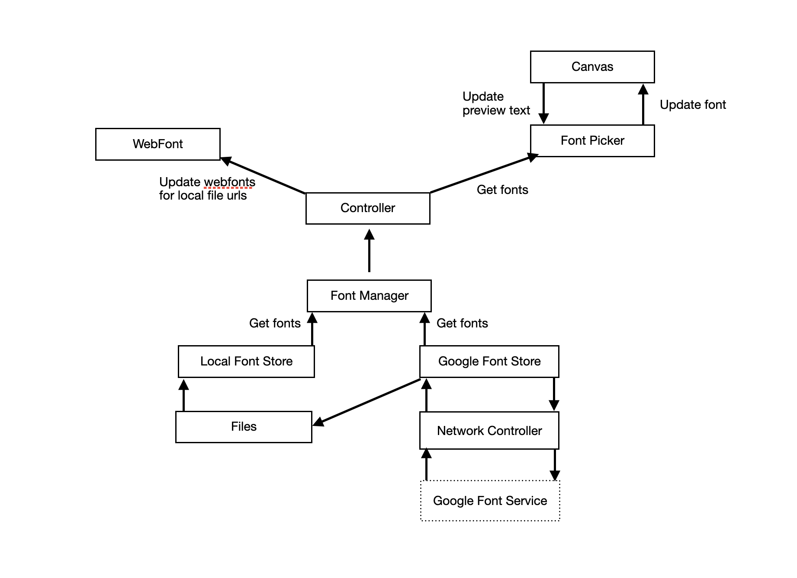

# Google Font Picker
This project implemented a simple page for browsing/selecting google font list. The font picker can preview the font with text from the text box real-time.

## System Architecture

### Networking Layer
Built the endpoints of google font services and wrapped URLSession and requests into a network controller.

### Storage Layer
Saved the downloaded ttf files in the app data folder and the file urls into WebFont models.

### Logic Controller
Implemented two logic controllers (aka font stores) for downloading and saving Google web fonts and for retrieving local font files and converting to UIFont objects respectively, and then added a FontManager Singleton to retain remote and local font stores and web fonts using Facade design pattern.

### UI Layer
Implemented the font picker using MVC design pattern, the canvas as a container view controller and the font picker as its child view controller. So the font picker can be added into the canvas and removed later on demand. 

### Data Binding
Bind URLSession, NotificationCenter, and KVO for data using Combine.
